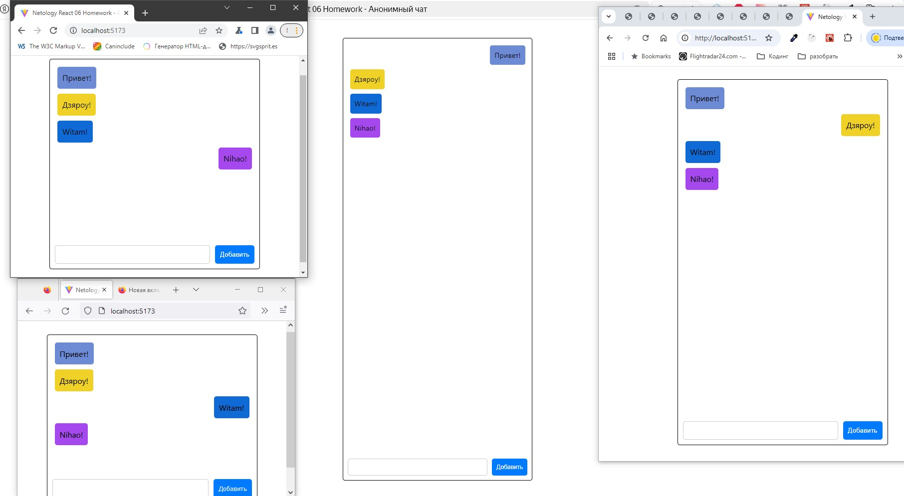

<a name="top"></a>
# Анонимный чат

[вернуться в корневой readme](../README.md)


- [Задание](#задание)
- [Решение](#решение)

## Задание

Вам необходимо реализовать абсолютно анонимный чат, хотя такого, конечно, не бывает ☺, в который сможет отправлять сообщения любой желающий.  
Но есть важное требование: если вы даже открыли другую вкладку в браузере, написание всё равно должно идти с вашего аккаунта.

Backend вы можете взять готовый из каталога **backend**.


### Общая механика 
При создании компонента создаётся интервал или таймаут и делается периодический опрос сервера в виде http-запроса GET на адрес http://localhost:7070/messages?from={id}, где id — идентификатор последнего полученного сообщения при первоначальной загрузке — 0. Временной интервал предложите сами.  

Формат присылаемых данных:
```json
[
    {
        "id": 1,
        "userId": "5f2d9da0-f624-4309-a598-8ba35d6c4bb6",
        "content": "Какая сейчас погода за окном?"
    },
    {
        "id": 2,
        "userId": "5f2d9da0-f624-4309-a598-8ba35d6c4bb6",
        "content": "К сожалению, я не знаю ответа на этот вопрос"
    }
]
```
Где userId — уникальный идентификатор анонимного пользователя. Подумайте, как его сгенерировать и где хранить. Если не придумали — прочитайте спойлеры.

Полученные данные отображаются в виде блоков с возможностью различного выравнивания:
- ваши — справа;
- не ваши — слева.

Ваши или не ваши вы определяете путём сравнения своего userId и того, что в сообщении.

**Добавление:**  
1. Вы заполняете форму и нажимаете кнопку «Добавить».  
2. Выполняется http-запрос POST на адрес http://localhost:7070/messages, в теле запроса передаётся следующий JSON:
```json
{
    "id": 0,
    "userId": "5f2d9da0-f624-4309-a598-8ba35d6c4bb6",
    "content": "То, что было введено в поле ввода"
}
```
3. После чего ждёте, пока не произойдёт получение данных по интервалу. Подумайте, как сделать ожидание комфортным для пользователя и как решают эту проблему существующие чаты..

**Спойлеры**
- Добиться уникальности анонимов можно, просто записав в local/sessionStorage случайно сгенерированный ID: nanoid, uuid. И использовать его для отправки и получения данных.
- Подумайте, какие уязвимости в безопасности создаёт подобная схема и возможна ли отправка сообщений от лица другого пользователя.
- Подумайте над тем, как это можно предотвратить.

**Advanced**
Попробуйте раскрашивать сообщения от разных пользователей в разные цвета.
Попробуйте реализовать авто-скроллинг до последнего сообщения.

[Вверх](#top)

## Решение

Реализован компонент анонимного чата на минималках по условиям ТЗ:
- генерация Id пользователя с помощю библиотеки uuid,
- реализована проверка на наличие Id пользователя в localStorage для того, чтобы в одной сессии браузера можно было писать с разных вкладок,
- реализована "оптимистичная" отправка сообщений в чат - отправка на сервер, запись в стейт и фильтрация сообщения при получении сообщений,
- реализован периодический опрос сервера для получения новых сообщений,
- реализованы раскраска сообщений на основе Id пользователя и позиционирование сообщений ("свои" - справа, "чужие" - слева).
- при закрытии вкладки с компонентом реализовано удаление таймера, возможно, надо ещё и userId удалять.

Отключен StrictMode в main.tsx, так как компонент при запуске проходит двойной жизненный цикл. 

Скриншот продукта:  


[Вверх](#top)