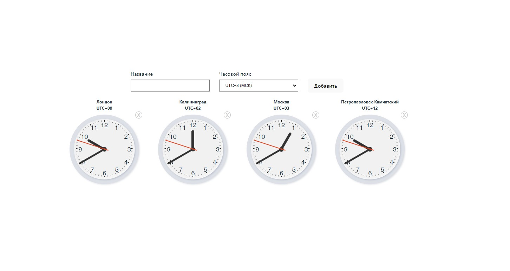

# Мировые часы

[вернуться в корневой readme](../README.md)

- [Задание](#задание)
- [Решение](#решение)

## Задание

Наверняка вы видели в офисах многих компаний установленные часы, показывающие время в разных столицах мира:
- New York,
- Moscow,
- London,
- Tokyo.

Общая механика:
- Вы заполняете поля «Название» и «Временная зона», указываете смещение в часах относительно Гринвича и нажимаете кнопку «Добавить».
- Часы автоматически добавляются и, что самое важное, начинают тикать, то есть отсчитываются секунды, минуты и часы.
- При нажатии на крестик рядом с часами часы автоматически удаляются, при этом все подписки — setTimeout, setInterval и другие — должны вычищаться в соответствующем методе жизненного цикла.

Упрощения: если вам сложно реализовать механику со стрелками через css — см. transform и rotate(), то вы можете сделать цифровые часы, где отображаются только цифры в формате: ЧЧ:ММ:СС.

Подсказки:
- Посмотреть текущий TimezoneOffset вы можете, используя объект Date.
- Можете использовать библиотеку Moment.js.

[Вверх](#top)

## Решение

Создан stateful-компонент приложения Watches с дочерним stateless-компонентом WatchControl, в котором находится форма для добавления нового города и дочерними компонентами Watch, отображающими часы для добавленного города.  
Компонент Watch построен как класс для отслеживания этапов жизненного цикла, так как внутри используется setTimeout и его надо удалять при уничтожении компонента.

Скриншот продукта:  

[Вверх](#top)